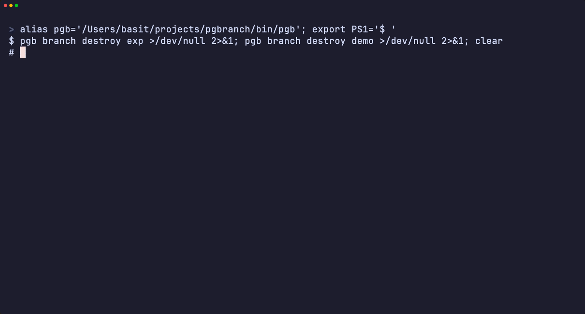

# Ways to use pgbranch

pgbranch gives you **instant, disposable, copy-on-write branches of a real
Postgres database**. Below are the common ways teams use it, smallest to
largest, each with a concrete example. They compose — most teams end up using
two or three together.

| Use case | What you get | Start here |
|---|---|---|
| [Local dev](#1-local-development) | throwaway prod-shaped DBs on your laptop | `pgb` CLI |
| [A database per test](#2-a-database-per-test) | isolated DB for every test, auto-destroyed | `pgbranchtest` SDK |
| [Branch per pull request](#3-branch-per-pull-request) | each PR gets its own masked DB | `pgbranch-github` webhook |
| [Preview environments](#4-preview-environments) | per-PR app **and** DB, with a URL on the PR | webhook + a deploy step |
| [Reviewing migrations](#5-reviewing-migrations-with-pgb-diff) | see exactly what a change does to prod-shaped data | `pgb diff` |



*branch → apply a migration → `pgb diff` (schema + row deltas) → branch-off-a-branch, against a masked clone of prod.*

A note that informs several patterns below — **credential modes**:

- **inherit (default)** — every branch shares the source's credentials. A
  static connection string works for any branch, which is what fixed
  configs (Vercel-style env vars) need.
- **rotation** (`--rotate-branch-credentials`) — every branch gets its own
  password. Safer for shared/long-lived branches, but a consumer must fetch
  the per-branch password (from the REST API) rather than hold a static one.

---

## 1. Local development

Seed once from any reachable Postgres, then branch as many times as you like.
Branches are real, writable Postgres instances; throw them away freely.

```bash
# seed a source from prod (read replica recommended); pg_basebackup is used
PGPASSWORD=… pgb source add prod --host replica.internal --user repl
# …or from a managed provider (Supabase/Neon/RDS) that blocks basebackup:
PGPASSWORD=… pgb source add prod --via dump --dump-schema public \
  --host db.<ref>.supabase.co --user postgres --pg-version 17

pgb branch create feature-x --from prod   # ready in ~2s, ~33 MiB
psql "$(pgb connect feature-x)" -c "ALTER TABLE orders ADD COLUMN tag text"
pgb branch reset feature-x                 # discard all changes, pristine again
pgb branch create exp --from-branch feature-x   # branch off a branch
pgb branch destroy feature-x exp
```

Scrub PII once on the source and every branch inherits the masking:

```bash
pgb source set-mask prod mask-pii.sql      # SQL run before a branch is ready
```

## 2. A database per test

Give every test (or test binary) its own isolated, prod-shaped database that
is destroyed when the test finishes — no shared fixtures, no cleanup.

**Go** (`github.com/abd-ulbasit/pgbranch/pgbranchtest`):

```go
func TestOrders(t *testing.T) {
    b := pgbranchtest.Acquire(t)          // a branch, auto-destroyed via t.Cleanup
    db, _ := sql.Open("pgx", b.DSN)
    // …run the test against real prod-shaped data…
}
```

**JavaScript** (`pgbranch-test`, zero deps, Node 18+):

```js
import { acquire } from 'pgbranch-test';
const branch = await acquire({ source: 'prod' });
// use branch.proxyDsn …
await branch.destroy();
```

**CI** (reusable Action):

```yaml
- uses: abd-ulbasit/pgbranch/action@main
  with: { server: ${{ vars.PGBRANCH_API }}, token: ${{ secrets.PGBRANCH_TOKEN }}, source: prod }
# … your tests use the branch it created …
- uses: abd-ulbasit/pgbranch/action/destroy@main
```

The SDK is integration-only (it talks to a running `branchd`); point it with
`PGBRANCH_SERVER`/`PGBRANCH_TOKEN`. See [Testing](testing.md).

## 3. Branch per pull request

Run `pgbranch-github` (the webhook service, in the Helm chart as
`ghook.enabled=true`). Each PR gets a branch, a `pgbranch/branch` commit
status, and a comment with the connection string.

```yaml
# values.yaml (excerpt)
ghook:
  enabled: true
  source: prod
  resetOnPush: true        # new commits reset the branch to a fresh snapshot
  branchNaming: git-branch # name the branch after the git ref, not pr-<N>
  proxyHost: pg.example.com:6432
```

`branchNaming: git-branch` matters for preview platforms: the branch is named
after the PR's head ref (sanitized), so a deploy can derive the database
branch from the git ref it already knows — available on the *first* build,
before the PR-number association exists. Full setup: [GitHub App](github-app.md).

## 4. Preview environments

The complete "Vercel-style" experience — each PR gets a deployed **app** and
its own **database** — is two cooperating pieces:

- **pgbranch** supplies the per-PR database branch (use case 3).
- **your platform/CI** deploys the app for the PR and points it at that
  branch. pgbranch deliberately doesn't deploy apps; that's the platform's job.

The app derives its branch from the git ref (matching `branchNaming:
git-branch`), so configuration is static — no per-PR secrets:

```js
// the app picks its branch from the deploy's git ref
const branch = sanitize(process.env.GIT_REF);           // e.g. feat-login
const pool = new Pool({ host: PGBRANCH_HOST, port: 6432,
  user: 'app', password: PGBRANCH_PASSWORD,             // inherit mode → static
  database: `appdb@${branch}` });                        // proxy routes by name
```

Two ways to wire the deploy, both demonstrated in
[pgbranch-demo](https://github.com/abd-ulbasit/pgbranch-demo):

- **Managed platform (Vercel/Netlify/Render)** — set `PGBRANCH_HOST` etc. as
  project env vars pointing at the proxy; the platform builds a preview per
  PR and the app connects through the proxy with `dbname@branch`. Use
  **inherit** credentials (static env). Requires the proxy to be reachable
  from the platform (a public LoadBalancer).
- **Self-hosted (GitHub Action → your cluster)** — a `pull_request` workflow
  deploys the app image to the cluster pointed at the branch and posts the
  preview URL. See the demo repo's `.github/workflows/pr-preview.yml`.

> **Don't give CI a cluster-admin kubeconfig.** The preview pipeline only ever
> deploys into one namespace, so scope it there. Apply the namespaced
> ServiceAccount + Role in [`deploy/preview-deployer-rbac.yaml`](../deploy/preview-deployer-rbac.yaml)
> once (it grants only the verbs a `helm upgrade --install` of the chart and an
> app deploy need in `pgbranch-preview` — no ClusterRole), then mint a
> short-lived token for the workflow instead of a long-lived admin credential:
>
> ```bash
> kubectl apply -f deploy/preview-deployer-rbac.yaml
> kubectl -n pgbranch-preview create token preview-deployer --duration=24h
> ```
>
> For branchd's own REST API, mint a *scoped* bearer rather than reusing the
> built-in `PGBRANCH_TOKEN` admin: `pgb token create ci --role operator` gives
> CI exactly branch create/reset/destroy (`pgb token` is admin-only).

> Reachability note: managed platforms live on the public internet, so the
> Postgres proxy must be publicly reachable (e.g. a cloud LoadBalancer). A
> private cluster (Tailscale/VPN-only) can serve the *webhook* publicly but
> not a raw-TCP proxy — there, run the preview app *inside* the cluster.

## 5. Reviewing migrations with `pgb diff`

See exactly what a branch's migrations did, against prod-shaped data, before
merging — schema diff plus per-table row deltas vs the branch's own base:

```bash
$ pgb diff feature-x
@@ … @@
+CREATE TABLE public.shipments ( id bigint, order_id bigint NOT NULL, … );
+ALTER TABLE ONLY public.orders ADD CONSTRAINT orders_shipment_fkey …

TABLE      BASE  BRANCH  DELTA
shipments  0     0       +0
(row counts are planner estimates)
```

Run it by hand, or post it on the PR from CI. It spins up a throwaway clone of
the branch's base, dumps both, and tears the clone down — so it always
compares against the right point-in-time snapshot.

---

For deployment specifics see [Kubernetes](kubernetes.md) and
[Running on EKS](eks.md); for how it all works, [Architecture](architecture.md).
